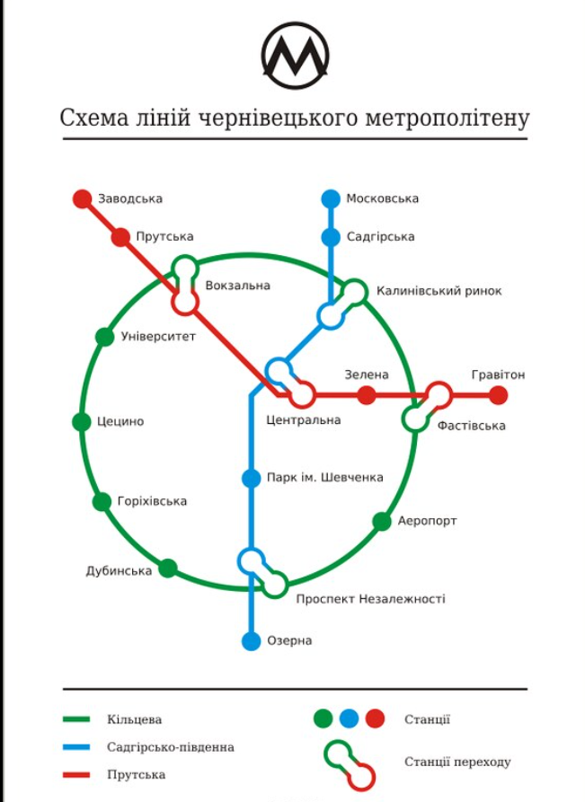
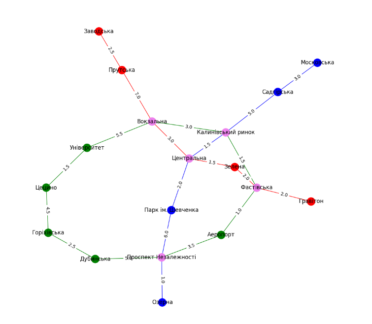

### goit-algo-hw-06
# Графи. ДЗ #6

## Завдання 1

### Візуалізація схеми Чернівецького метро, знайденої в інтренеті.

### Результат візуалізації (відстані між станціями - умовні):

Характеристика графа (схеми метро):
Кількість ліній: 3
Кількість станцій: 18
Кількість міжстанційних перегонів: 21
Кількість переходів між лініями: 5
Кількість інших станцій з якими безпосердньо з'єднана станція:
    -Заводська             : 1 ['Прутська']
    -Прутська              : 2 ['Заводська', 'Вокзальна']
    -Вокзальна             : 4 ['Прутська', 'Центральна', 'Університет', 'Калинівський ринок']
    -Центральна            : 4 ['Вокзальна', 'Зелена', 'Калинівський ринок', 'Парк ім. Шевченка']
    -Зелена                : 2 ['Центральна', 'Фастівська']
    -Фастівська            : 4 ['Зелена', 'Гравітон', 'Калинівський ринок', 'Аеропорт']
    -Гравітон              : 1 ['Фастівська']
    -Московська            : 1 ['Садгірська']
    -Садгірська            : 2 ['Московська', 'Калинівський ринок']
    -Калинівський ринок    : 4 ['Садгірська', 'Центральна', 'Вокзальна', 'Фастівська']
    -Парк ім. Шевченка     : 2 ['Центральна', 'Проспект Незалежності']
    -Проспект Незалежності : 4 ['Парк ім. Шевченка', 'Озерна', 'Аеропорт', 'Дубинська']
    -Озерна                : 1 ['Проспект Незалежності']
    -Університет           : 2 ['Вокзальна', 'Цецино']
    -Аеропорт              : 2 ['Фастівська', 'Проспект Незалежності']
    -Дубинська             : 2 ['Проспект Незалежності', 'Горіхівська']
    -Горіхівська           : 2 ['Дубинська', 'Цецино']
    -Цецино                : 2 ['Горіхівська', 'Університет']

## Завдання 2
Контрольне завдання для алгоритму - починаючи зі ст.'Гравітон' знайти ст.'Парк ім. Шевченка'.

Результат пошуку вглиб:
Шлях від 'Гравітон' до 'Парк ім. Шевченка' по методу DFS знайдено після обходу **13** вузлів:
['Гравітон', 'Фастівська', 'Зелена', 'Центральна', 'Вокзальна', 'Прутська', 'Заводська', 'Університет', 'Цецино', 'Горіхівська', 'Дубинська', 'Проспект Незалежності', 'Парк ім. Шевченка']

Результат пошуку вшир:
Шлях від 'Гравітон' до 'Парк ім. Шевченка' по методу WFS знайдено після обходу **5** вузлів:
['Гравітон', 'Фастівська', 'Зелена', 'Центральна', 'Парк ім. Шевченка']

Така різниця в кількості вузлів, що були пройдені для пошуку цільової станції пояснюється особливостями обох алгоритмів - пошук вглиб йде до кінця гілки і тільки потім переходить на наступну гілку, тоді як пошук вшир переглядає послідовно сусідні рівень за рівнем. Твердження з конспекту, що алгоритм пошуку вшир більше підходить саме для пошуку - підтверждене.

Обидва алгоритми пошуку були реалізовані за допомогою рекурсії (новий для мене підхід) для тренування, без копіювання коду з конспекту - по опису принципу алгоритму.
Наведено два варіанта для  пошуку вглибину - вони по різному повертають знайдений результат через послідовність викликаних рекурсивно функцій.

## Завдання 3
Контрольне завдання для алгоритму - знайти найкоротші відстані від ст.'Центральна' до усіх інших станцій.

Результат роботи алгоритму Дейкстри:
Найкоротші дистанції від станції Центральна:
Заводська 12.5
Прутська 10.0
Вокзальна 3.0
Центральна 0
Зелена 1.5
Фастівська 3.0
Гравітон 5.0
Московська 9.5
Садгірська 6.5
Калинівський ринок 1.5
Парк ім. Шевченка 2.0
Проспект Незалежності 7.5
Озерна 8.5
Університет 8.5
Аеропорт 4.0
Дубинська 12.5
Горіхівська 14.5
Цецино 10.0
